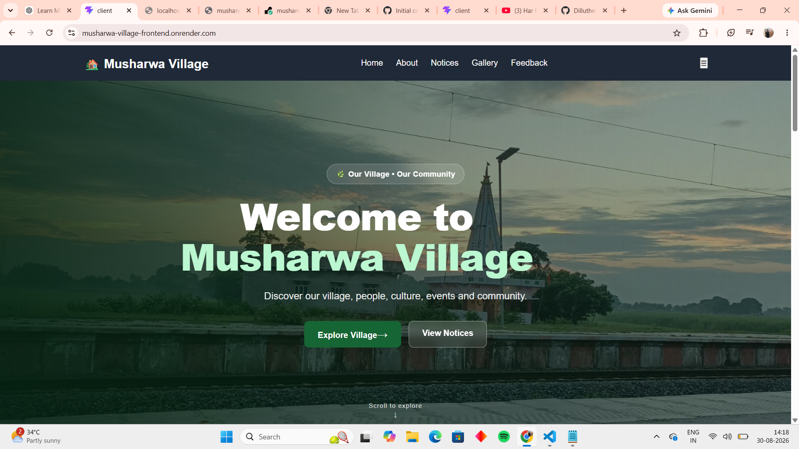
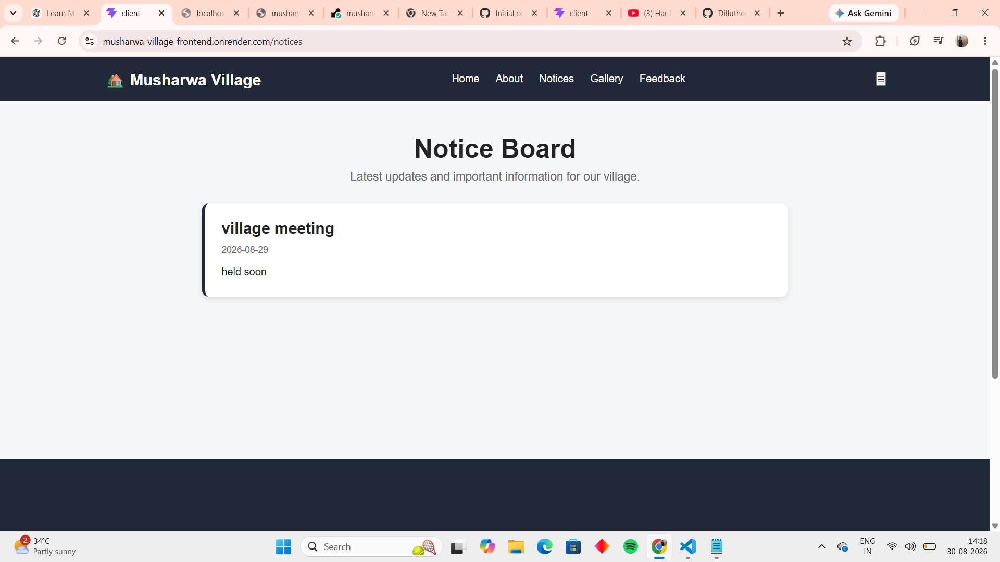
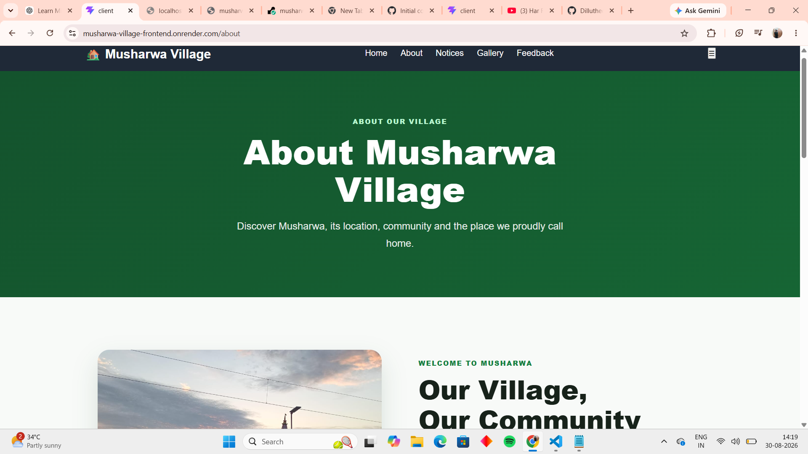
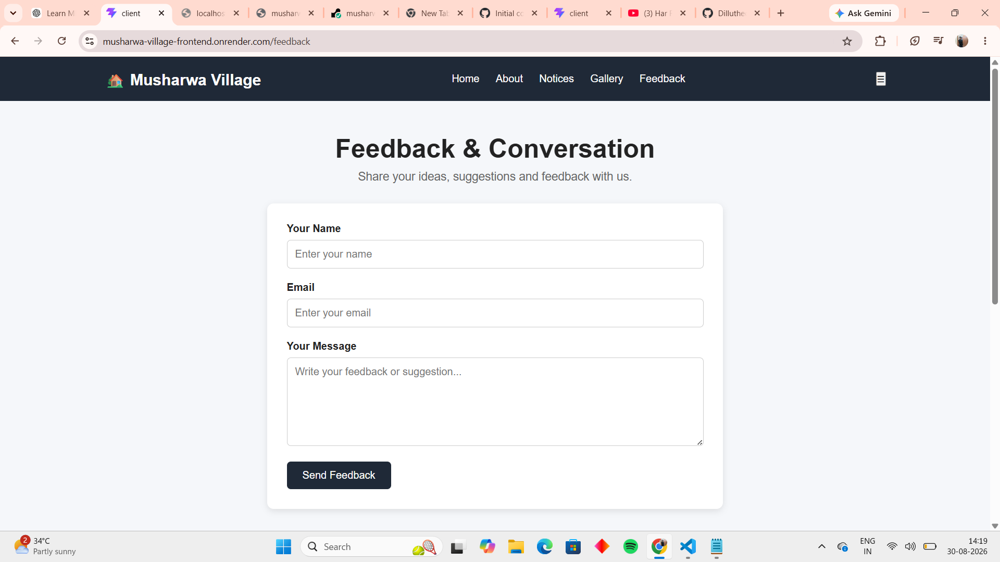
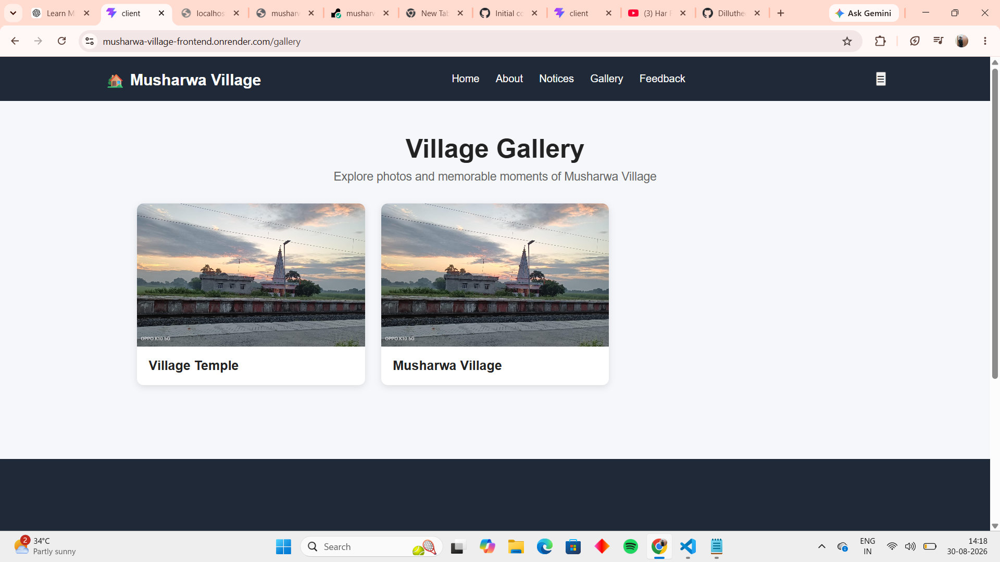

# 🏡 Musharwa Village Community Portal

A full-stack **MERN Stack community portal** developed for Musharwa Village to provide a digital platform for sharing village information, notices, gallery updates, and community feedback.

The application includes a **public-facing website** and an **admin dashboard** for managing dynamic content.

---

## 🌐 Live Demo

🚀 **Frontend:** https://musharwa-village-frontend.onrender.com

⚙️ **Backend API:** https://musharwa-village.onrender.com

---

## 📸 Screenshots

### 🏠 Home Page



### 📢 Notice Board



### ℹ️ About Page



### 💬 Feedback Page



### 🖼️ Gallery



---

## ✨ Features

### 👥 Public Website

* 🏠 Village Home Page
* 📢 Dynamic Notice Board
* 🖼️ Village Gallery
* 💬 Community Feedback
* 📱 Responsive user interface
* 🌐 Live deployment

### 🔐 Admin Dashboard

* 🔑 Admin Login
* ➕ Add notices
* 🗑️ Delete notices
* 🖼️ Add gallery photos
* 🗑️ Delete gallery photos
* 💬 View community feedback
* 🗑️ Delete feedback

### 🗄️ Database

* MongoDB Atlas integration
* Stores notices
* Stores gallery information
* Stores community feedback

---

## 🛠️ Tech Stack

### Frontend

* React.js
* Vite
* JavaScript
* HTML5
* CSS3
* React Router

### Backend

* Node.js
* Express.js
* MongoDB
* MongoDB Atlas
* REST API

### Deployment & Tools

* GitHub
* Render
* MongoDB Atlas
* VS Code

---

## 📁 Project Structure

```text
musharwa-village/
│
├── client/
│   ├── public/
│   ├── src/
│   │   ├── components/
│   │   ├── pages/
│   │   └── ...
│   ├── package.json
│   └── vite.config.js
│
├── server/
│   ├── server.js
│   ├── package.json
│   └── ...
│
├── screenshots/
│   ├── Hme.png
│   ├── Notice.png
│   ├── About.png
│   ├── Feedback.png
│   └── Gallary.png
│
└── README.md
```

---

## 🔄 Application Flow

```text
User
  ↓
React Frontend
  ↓
REST API
  ↓
Express + Node.js
  ↓
MongoDB Atlas
```

---

## 🎯 Project Objective

The main objective of this project is to create a simple digital platform for **Musharwa Village** where users can access important information and interact with community features online.

The project also demonstrates practical implementation of **full-stack web development using the MERN Stack**.

---

## 🚀 Future Improvements

* 🔔 Real-time notifications
* 👤 User authentication
* 📅 Village events and announcements
* 🏢 Local services directory
* 📱 Progressive Web App (PWA)
* ☁️ Improved cloud-based image storage

---

## 👨‍💻 Developer

**Dillu Kumar Chaubey**

Built using the **MERN Stack** with React, Node.js, Express.js and MongoDB.
